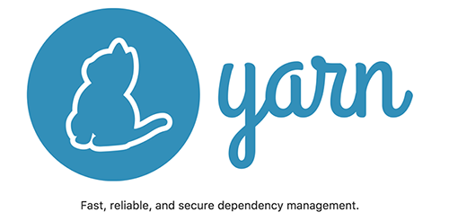
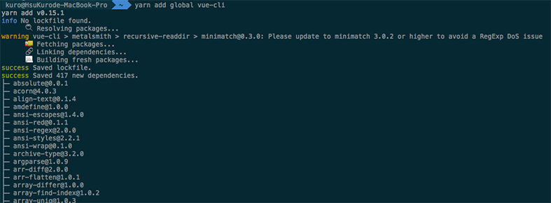
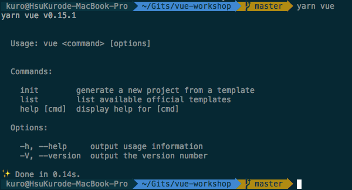
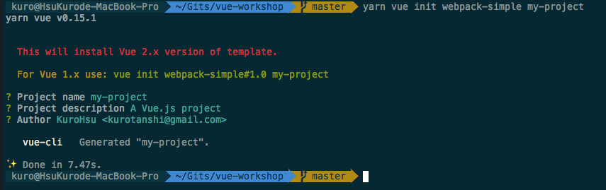
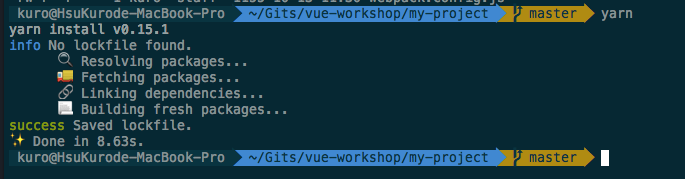
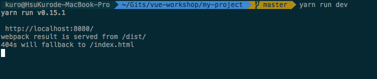
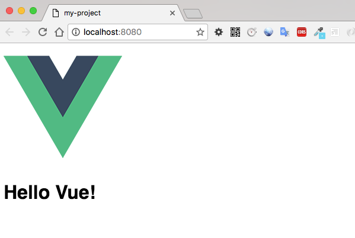
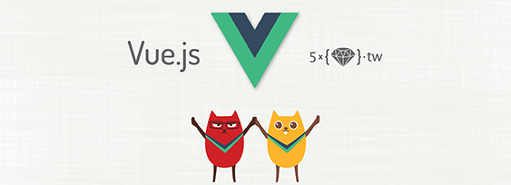

# 利用 Yarn 安装 Vue-cli

这两天 JavaScript 圈子的最大新闻应该就是 Facebook 发布了一套新的 JavaScript 套件管理工具 Yarn，感觉来势汹汹势不可挡。 实际花了一点时间试用，表现的确也比过去 npm 好很多，尤其过去 `npm install` 速度过慢，套件相依冲突的问题，目前在 Yarn 还没遇到。 即使是刚开始 `yarn run scripts` 无法带入参数的问题，在发布的第二天也快速地更新 (v0.15.1) 解决了。 👍

有关 Yarn 介绍的部分，已经有其他前辈分享了，推荐可以看看这篇 [取代 npm 的新利器 Yarn](https://medium.com/@jackypan1989/%E5%8F%96%E4%BB%A3-npm-%E7%9A%84%E6%96%B0%E5%88%A9%E5%99%A8-yarn-7d97f2f409b9#.pu0jrdcc4)。

既然 Yarn 号称可以用来取代 npm，那么身为 Vue 的爱好者，也想马上来试试 [Vue-cli](https://github.com/vuejs/vue-cli) 这套 Vue 的样板工具包是否也可以透过 yarn 来单独执行。

既然要取代 npm，那么第一件事情就是把 npm 整包干掉，关于删掉 npm modules 的过程我是参考 stackoverflow 的这篇: [Command to remove all npm modules globally?](http://stackoverflow.com/questions/9283472/command-to-remove-all-npm-modules-globally)，但实际上 Yarn 与 npm 是可以和平共存的，不一定要把 npm 干掉才能跑 Yarn ，这里只是想简单做个试验，啾咪 ^.<

然后安装 Yarn。 执行 `curl -o- -L https://yarnpkg.com/install.sh | bash` 即可。

## 第一步：安装 vue-cli

很简单，把原本的 `npm install -g vue-cli` 改成 `yarn add global vue-cli` 就可以了。执行的时候像这样： 

而安装完毕后，执行 `yarn vue` 应该可以看到这样的画面。 

每执行完一个指令还会告诉你它跑了多久喔，非常嚣张 (误)。

## 第二步：初始化 Vue 专案

接著，就来初始化我们的 Vue 专案。 Vue-cli 这个 scaffolding 工具官方目前提供了几种 template 让开发者自行选择， 像是大家常见的 webpack、browserify 都有。当然也可以挑选什么都没有的 simple: 就是最基本的 Vue 专案这样。 如果想更详细了解各种 template 细节的话，可以到 vue-templates 的 [Repo](https://github.com/vuejs-templates) 去看。

这里我就选择拿「[webpack-simple](https://github.com/vuejs-templates/webpack-simple)」当范例。

执行 `yarn vue init webpack-simple my-project`

因为 VueJS 目前已经发布至 2.0 版了，所以你会看到 Vue-cli 很贴心地提醒你现在安装的是 2.0 的版本。 若你想安装的是 1.x 版本的话，可以改成 
`yarn vue init webpack-simple#1.0 my-project` 即可。

然后，Vue-cli 会帮我们建立一个新目录 `my-project`。

透过 `cd my-project` 切换到新专案目录后，我们将原本的 `npm install` 改成直接执行 `yarn` 即可。

 

## 第三步：启动并执行 vue 专案

最后，直接执行 `yarn run dev` 应该会看到像这样的画面。 

 

打开你的浏览器连到 `http://localhost:8080/` 看到 `Hello Vue!` 的字样就代表成功执行啰！ 

 

vue.js 2.0 入门实战 

工商服务时间： 10/15 小弟在台北开了以 VueJS 2.0 为基础的工作坊课程， 
课程传送门: VUE.JS 2.0 入门实战 
如果你也对 VueJS 有兴趣，或是想进入 VueJS 2.0 却不知该从何开始，欢迎一起参加。 😃